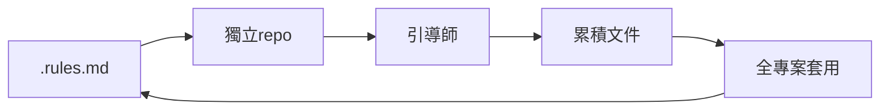

### my-ai

- 前端專用的 AI 輔助開發規範倉庫（submodule）。同時支援 **Vue / Nuxt** 與 **Angular** 兩種前端框架。作為專案的 `my-ai/` 子模組使用。
- [參考 aidata](https://git.zbdigital.net/architecture/aidata.git)

### SubModules

<details>

<summary>新建資料夾時</summary>

終端機先交給 Git 託管(`git init`)

指令`git submodule add ${Clone HTTPS}`加入子模組

</details>

<details>

<summary>已有專案時</summary>

新增 `.gitmodules`，並寫入:

```ini
[submodule "my-ai"]
    path = my-ai
    url = https://github.com/NainsWebDESIGN/my-ai.git
    ignore = all
```

終端更新子模組狀態`git submodule sync`
指令加入子模組`git submodule update --init --recursive`

</details>

將`.clinerule.md` 拖到外層根目錄並依照使用的 Agent 更名

## 結構

```ini
my-ai/
├── CLAUDE.md / AGENTS.md    ← AI 自動讀取的入口
├── PLAN_SPEC.md             ← Plan 規格書規範（含 Vue/Nuxt + Angular Phase）
├── performance-rules.md     ← 效能規範
├── systemprompts/           ← 引導師 prompt（10 個）
├── testing/                 ← 測試規範
└── templates/
    ├── vue-template/          ← Nuxt 3 + Vuetify 起始模板
    ├── angular-template/    ← Angular CLI 起始模板（TypeScript + SCSS）
    └── design-md/           ← 80+ 站台設計範本
```

## 引導師

| 觸發語            | 功能                                    |
| ----------------- | --------------------------------------- |
| `@plan-maker`     | 撰寫 Plan 規格書                        |
| `@plan-executor`  | 依 Plan 逐步實作                        |
| `@repo-init`      | 初始化新專案                            |
| `@pr-review`      | PR 提交前審查                           |
| `@test-maker`     | 產生測試計畫                            |
| `@ai-tester`      | 執行測試腳本                            |
| `@debug-helper`   | 除錯引導                                |
| `@perf-review`    | 效能分析                                |
| `@session-log`    | 記錄對話摘要，讓下一個 agent 繼承上下文 |
| `@lesson-learned` | 記錄 bug 經驗                           |
| `@task-helper`    | 任務分析與理解                          |

### AI 初創流程建議

全專案套用到回頭迭代優化



### AI完整決策結構圖

AI 收到你的指令後

<details>

<summary>第1層：AI 工具平台層</summary>

.clinerules → 給 Cline（你現在用的工具）看

這些檔案決定 AI 的「人設」和基本行為

</details>

<details>

<summary>第2層：永遠生效的核心規則</summary>

📌 general.md:

> 規範文件總索引表 +
> Branch Gate +
> 引導師路由

📌 coding-behavior.md → AI 行為四大準則

> ① 編碼前先想清楚
> ② 簡潔優先
> ③ 精準修改
> ④ 目標驅動

這兩份是 AI 的「憲法」，每次對話都必須遵守

</details>

<details>

<summary>第3層：副檔名自動觸發規則（globs）</summary>

當 AI 要修改的檔案符合 glob 模式時，自動載入對應規範：

_.cs / _.csproj ──→ csharp.mdc → 載入 C# 規範全餐

\_.py ──→ python.mdc → 載入 Python 規範

_.vue / _.ts 等 ──→ 無自動觸發 → 手動讀 .rules.md或.clinerule.md

</details>

<details>

<summary>第4層：代碼特徵深度判斷（coding-rules.md）</summary>

【C# 專案】先判斷 Service Kind：

- atomic (有 DB Settings) → service-kind-atomic
- integration (只有 Gateway) → service-kind-integration
- service (Worker) → service-kind-background

【Python 專案】依序判斷：

- FastAPI / Flask 特徵？ → webapi 規範
- Provider / Parser 名稱？ → crawler 規範
- async / sync 特徵？ → service 規範

【前端專案】讀取 repo 根目錄的 .rules.md或.clinerule.md

</details>

<details>

<summary>第5層：引導師系統（@ 關鍵字觸發）</summary>

你打特定關鍵字時，AI 載入對應的 System Prompt：

`@plan-maker` → 訪談後產出開發計畫

`@plan-executor` → 逐步執行計畫

`@pr-review` → 提交前審查（Commit Gate）

`@service-teacher` → 解釋服務功能

`@debug-helper` → 引導排查 bug

`@test-maker` → 產測試計畫

...等 12 個引導師

</details>

<details>

<summary>第6層：業務知識查詢（documents.md）</summary>

需要了解業務邏輯時，AI 會依序查：

優先：{kind}/{service}/documents.md（各服務文件）

其次：\_-detail.md / README

最後：confluence/\_index.md（全公司文件，不整檔讀）

跨服務主題：

others/architecture-documents.md → 架構

others/game_bussiness-documents.md → 博彩業務

others/stock_bussiness-documents.md → 股票業務

</details>

---

| 判斷機制              | 動作                                                                                     |
| --------------------- | ---------------------------------------------------------------------------------------- |
| 第2層 alwaysApply     | 載入 `coding-behavior.md`（先想清楚、不改多餘的）                                        |
| 第2層 alwaysApply     | 載入 `general.md`→ 看到提新功能 → 觸發 `@plan-maker`                                     |
| 第5層 引導師          | 載入 `plan-maker-prompt.md`，開始訪談需求                                                |
| 訪談完畢後開始改 Code | 第3層 偵測到 `.vue` → 無 glob 自動觸發                                                   |
| 第4層 - .rules.md     | 讀取 `pricefrontendsite` repo 根目錄的 `.rules.md`或`.clinerule.md`（前端規範）          |
| 第6層 業務知識        | 讀 `aidata/frontend/_index.md` → 找到 `pricefrontendsite/documents.md`，了解賠率業務邏輯 |
| 第2層 Branch Gate     | 檢查是否在 main/master，是否需要切分支                                                   |
| 開始寫 Code           | 遵守 coding-behavior 四原則：簡潔、精準、不亂改                                          |
